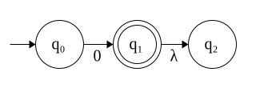
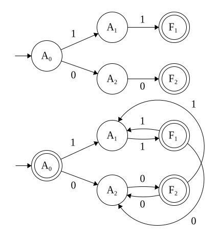

## 4. Dado un autómata finito para $\mathcal{L}$, indicar cómo construir autómatas finitos para los siguientes lenguajes. Indicar en cada caso si es necesario que el autómata de entrada sea determinístico o no, y de qué tipo es el autómata resultante.

### a) $\mathcal{L}^c$, el complemento de $\mathcal{L}$.

Basta con reemplazar el conjunto de estados finales por $F' = Q \backslash F$.

El autómata debe ser determinístico. El autómata resultante también es determinístico. 

Un contraejemplo para el caso no determinístico:

Tal vez funcione complementar sobre la clausura $\lambda$ de los estados finales para el caso AFND-$\lambda$.

### b) $\mathcal{L}^∗$, la clausura de Kleene de $\mathcal{L}$.

Hay que:

1. volver al estado inicial un estado final, tal que acepte $\lambda$.
2. para cada transición desde el estado inicial, hay que agregar la misma transición desde cada uno de los estados finales.

Por ejemplo:

Si una transición a agregar ya existe para algún estado final $f$ (hacia algún otro estado), o bien convertimos el autómata a un AFND, o bien:

1. buscamos todos los puntos de quiebre mínimos (en tanto equivalencia) entre las cadenas de estados a partir de $f$ y las cadenas de estados a partir del estado inicial.

2. agregamos, por cada uno, una transición desde el nodo que quiebra desde $f$ hacia el nodo 'faltante' que sigue en la cadena 'equivalente' a partir del estado inicial, tal que se pueda 'continuar' con la equivalencia. Estas transiciones siempre se podrán hacer, en tanto existan los puntos de quiebre (si la transición estuviera siendo 'usada', no sería un punto de quiebre). Si un punto de quiebre no existe, entonces el autómata ya contempla 'repetir' ese prefijo en particular.

Por ejemplo:

donde las transiciones con * son las agregadas.

Luego, está transformación se puede hacer para cualquier tipo de autómata y el autómata resultante es del mismo tipo.

### c) $\mathcal{L}^r$, la reversa de $\mathcal{L}$.

Basta con:

1. cambiar la dirección de todas las transición.
2. volver el estado inicial en un estado final.
3. Agregar un estado nuevo 'inicial', que por transiciones $\lambda$ se una a los finales anteriores.

Esto se puede realizar para cualquier autómata y el autómata resultante es AFND-$\lambda$.

### d) $Ini(\mathcal{L})=\{\alpha\ |\ \exists \beta\ \text{tal que}\ \alpha \beta \in \mathcal{L}\}$, los prefijos de $\mathcal{L}$.

Basta con convertir a todos los estados en estados finales.

Sirve para todo tipo de autómata y el autómata resultante es del mismo tipo que el de entrada.

### e) $Fin(\mathcal{L})=\{\alpha\ |\ \exists \gamma\ \text{tal que}\ \gamma \alpha \in \mathcal{L}\}$, los sufijos de $\mathcal{L}$.

Basta con agregar transiciones $\lambda$ desde el estado inicial a todo el resto de los estados. 

Esto se puede realizar para cualquier autómata y el autómata resultante es AFND-$\lambda$.

### f) $Sub(\mathcal{L})=\{\alpha\ |\ \exists (\beta,\ \gamma)\ \text{tales que}\ \gamma \alpha \beta \in \mathcal{L}\}$, las subcadenas de $\mathcal{L}$.

Basta con realizar las transformaciones de la parte (d) y (e). 

Esto se puede realizar para cualquier autómata y el autómata resultante es AFND-$\lambda$.

### g) $\max(\mathcal{L})=\{\alpha \in \mathcal{L}\ |\ \forall \omega \in \Sigma^+,\alpha \omega \notin \mathcal{L}\}$, las cadenas maximales de $\mathcal{L}$.

Para empezar, notar que si el autómata relacionado a $\mathcal{L}$ tiene ciclos, entonces $\max(\mathcal{L})$ es vacío.

Dicho esto, podemos realizar la siguiente transformación:

1. Si el autómata tiene ciclos, devolver algún autómata para el lenguaje vacío (ej. $(\{q_0, T\}, \Sigma, \delta: \delta(x) = T, q_0, \emptyset)$).
2. Si no:
    1. eliminar cualquier cadena 'inútil'. Es decir, que no conduzca a un estado final.
    2. armar un árbol de caminos máximos a partir del estado inicial (con bellman-ford y un peso de -1 por transición, por ejemplo).
    3. para cada estado final $f$, si $f$ no está a profundidad máxima en el árbol:
        1. remover $f$ del conjunto de estados finales.

El autómata resultante es de la misma clase que el de entrada. El autómata de entrada no tiene restricciones.

### h) $\min(\mathcal{L})=\{\alpha \in \mathcal{L}\ |\ \text{ningún prefijo propio de}\ \alpha\ \text{pertenece a}\ \mathcal{L}\}$, las cadenas minimales de $\mathcal{L}$. Es decir, $\min(\mathcal{L})=\{\alpha \in \mathcal{L}\ |\ \nexists(\omega_1,\omega_2)\ \text{tales que}\ \alpha = \omega_1\omega_2 \ \wedge\ \omega_1\in \mathcal{L}\ \wedge\ \omega_2\neq\lambda\}$.

Podemos realizar la siguiente transformación:

1. para cada estado final $f_i$:
    1. para toda transición $t$ desde $f_i$ que conduzca a algún otro estado final $f_j$ (incluyendo $i = j$):
        1. eliminar $t$
2. eliminar toda componente que haya quedado desconexa al estado inicial.

El autómata de entrada tiene que ser determinístico. Si no, podría pasar que haya dos cadenas aceptadas por el lenguaje, tal que una es prefijo de la otra, pero que no comparten 'camino' (notar que una manera sencilla de resolver esto es primero transformar al autómata en uno determinístico).

El autómata resultante también es determinístico.

### i) $\mathcal{L}_𝑇=\{\alpha \in \Sigma^∗\ |\ \exists (\omega_1 \in \mathcal{L},\omega_2\in \Sigma^∗)\ \text{tales que}\ \alpha =\omega_1\omega_2\}=\mathcal{L}.\Sigma^∗$.

Una forma sencilla sería agregar a cada estado final un loop que tome cualquier símbolo en $\Sigma$. Con un juego similar al de la parte (b) probablemente podríamos evitar convertir el autómata en no determinístico. 

El autómata de entrada puede ser de cualquier clase. El de salida es no determinístico.
