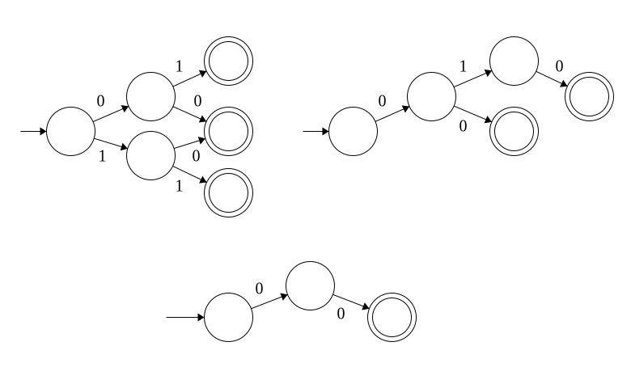

## 5. Dados autómatas finitos para $\mathcal{L}_1$ y $\mathcal{L}_2$ indicar cómo construir autómatas finitos para los siguientes lenguajes, con las mismas consideraciones que en el ejercicio anterior:

### a) $\mathcal{L}_1\cup\mathcal{L}_2$

Basta con definir un nuevo estado inicial que se una por transiciones $\lambda$ a los (anteriores) estados iniciales de $\mathcal{L}_1$ y $\mathcal{L}_2$.

Ambos autómatas de entrada pueden ser de cualquier tipo. El de salida es AFND-$\lambda$.

### b) $\mathcal{L}_1\cap\mathcal{L}_2$

Supongamos $\mathcal{L}_1$ se define por el autómata $(Q_1, \Sigma_1, \delta_1, q_{i_1}, F_1)$ y $\mathcal{L}_2$ se define por el autómata $(Q_2, \Sigma_2, \delta_2, q_{i_2}, F_2)$.

Podemos definir el nuevo autómata $A = (Q_3, \Sigma_3, \delta_3, q_{i_3}, F_3)$ por construcción recursiva:

1. $q_{i_3} \in Q_3$.
2. $q_{i_3}$ está asociado a $q_{i_1}$ y $q_{i_2}$. 
3. Si $q_{i_1}$ y $q_{i_2}$ son finales, $q_{i_3}$ es final. 
4. $\forall \omega \in Q_3$:
    1. $\omega$ tiene asociado a $\gamma_1 \in Q_1$ y $\gamma_2 \in Q_2$ (por construcción).  
    2. $\forall \sigma \in \Sigma_1 \cap \Sigma_2$: 
        1. si $\delta_1(\gamma_1, \sigma) = \kappa_1$ y $\delta_2(\gamma_2, \sigma) = \kappa_2$ son ambos distintos a trampa, entonces:
            1. $\delta_3(\omega, \sigma) = \phi$, donde:
                1. $\phi \in Q_3$, $\phi$ no es trampa ni el conjunto vacío.
                2. $\phi$ está asociado $\kappa_1$ y $\kappa_2$ en $Q_1$ y $Q_2$.
                3. Si $\kappa_1$ y $\kappa_2$ son finales, $\phi$ es final.
 
Por último, en el grafo asociado, eliminar todos los caminos 'inutiles' ie. que no conducen a un estado final.

Esto es, $A$ se construye a partir de la intersección de caminos 'equivalentes' entre los otros dos autómatas, que conducen a un estado final, y  manteniendo como estados finales solo aquellos estados finales que son compartidos por ambos autómatas. 

Por ej.:

En este caso consideré como entrada autómatas determinísticos (y la salida es consecuentemente también determinística). Sin embargo, se puede extender a autómatas no determinísticos y combinaciones. En el caso de combinar con AFND-$\lambda$, se deberán colapsar las transiciones $\lambda$.

### c) $\mathcal{L}_1\mathcal{L}_2$

Basta con concatenar por transiciones $\lambda$ los estados finales de $\mathcal{L}_1$ con el inicial de $\mathcal{L}_2$.

El autómata de entrada puede ser de cualquier tipo. El de salida es AFND-$\lambda$.

### d) $\mathcal{L}_1\backslash\mathcal{L}_2$

Podemos considerar una construcción similar a la de la parte (b). En este caso, conservando en caminos 'compartidos' solo aquellos estados finales que estén en $\mathcal{L}_1$ y no en $\mathcal{L}_2$.

Las consideraciones sobre la entrada y salida son iguales a las de la parte (b).
